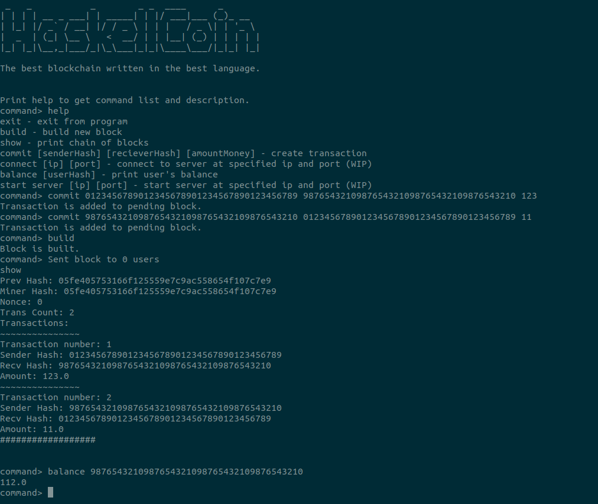

# HaskellCoin

[](https://github.com/MasterLogick/HaskellCoin/actions/workflows/haskell.yml)


Yet another blockchain but written in Haskell this time.



Print `help` to get the list of commands.
In alpha version you can commit transaction from any address to any address without limitations on amount. Just enter `commit` with user hashes and amount and enter `build` to create new block in the network.
Print `show` to list all blocks and transactions in the network.

## Usage
The introduction of blockchain increases the speed of exchange, reduces time costs, improves the quality, reliability and availability of services, and offers anonymity. At the same time, transparency and reliability are increased and risks are reduced. At each node of the blockchain system, copies of the entire database are stored and checked among themselves. This makes the system viable even in case of successful hacker attacks on its single nodes.

## Development

The project is developed with both stack and cabal.

### Building from sources

For building with `cabal`:
```sh
git clone https://github.com/MasterLogick/HaskellCoin
cd HaskellCoin
cabal v2-build
```
And for starting HaskellCoin just run `cabal v2-run` 

For building using `stack`:
```sh
git clone https://github.com/MasterLogick/HaskellCoin
cd HaskellCoin
stack build
```
And for starting HaskellCoin just run `stack run`

## Alpha version description:

Minimal blockchain system. The whole chain runs on the local machine without any network rules or transaction signing. CLI only.

Features:
+ Commit new trasnactino to pending block
+ Build new block from pending transactions
+ Show all blocks and transactions
+ Show current balance of specified user


## Release version features:

+ Blockchain explorer
+ Migrating to PoW (Proof of Work)
+ Saving blockchain to hard drive
+ Digital signature for every user (ECDSA on NIST-P521R1)
+ Propagating blocks over the Internet
+ Network rules
